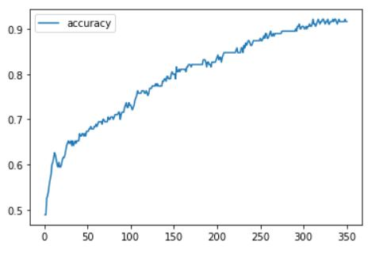

# Machine learning index prediction

This repository represents comparing of performance machine learning model and neural network model. It uses yesterday’s market data from various SP500 sub-indexes.

---

## Approach

1. Data Formating

2. Creating and tuning the Neural network (Sequential)

3. Creating and tuning the Linear Regression and/or logistic

4. Comparison

---

## Technologies

This project leverages the following tools for financial analysis:

- [Conda](https://docs.conda.io/en/latest/) - source package management system and environment management system.

- [Pandas](https://pandas.pydata.org) - Python library that’s designed specifically for data analysis.

- [JupyterLab](https://jupyter.org) - For running and review Python-based programs.

- [StandardScaler](https://scikit-learn.org/stable/modules/generated/sklearn.preprocessing.StandardScaler.html) - For Standardization of datasets

- [scilit-learn](https://scikit-learn.org/stable/) - tool forpredictive data alalysis

- [TensorFlow](https://www.tensorflow.org) - open-source machine learning platform

- [Keras](https://keras.io) - is an open-source software library that provides a Python interface for artificial neural networks.

---

## Input data

Input data is yesterday’s market data from various SP500 sub-indexes. Sub-indexes to use: Sectors.
`SP500.db` contains data foranalysis.

---

## Neural network

To create a neural network, a Sequential model was chosen. It is one of the most popular models in the Keras.

```
nn = Sequential() # creating model sequence
```

Example of the input data:


All data was separated for inputs and outputs:

1. Inputs are categories columns:

```
Industrials
Health Care
Information Technology
Communication Services
Consumer Staples
Consumer
Discretionary
Utilities
Financials
Materials
Real Estate
Energy
```

2. Outputs are SPY column transformed to discrete outputs/ like 0 and 1.

The test data (y_train) doesn't require to resampling. Proportions of the 0 and 1 are pretty similar.

```
0.0    96
1.0    94
Name: SPY, dtype: int64
```

During testing, a more efficient configuration was revealed:

```
Model: "sequential_1"
_________________________________________________________________
 Layer (type)                Output Shape              Param #
=================================================================
 dense_3 (Dense)             (None, 30)                360

 dense_4 (Dense)             (None, 15)                465

 dense_5 (Dense)             (None, 1)                 16

=================================================================
Total params: 841
Trainable params: 841
Non-trainable params: 0
```

After the trainig with 350 epochs. Great result!

```
Loss: 0.07584168016910553, Accuracy: 1.0
```




But with the test data results. Not bad.

```
Loss: 1.6455076932907104, Accuracy: 0.46875
```

Unfortunattly, using of the different activation functions (`linear, tanh, softmax`) and changing number of the layers didn't improve results.

## Contributors

Mike Canavan
Jose Tollinchi
David Lee Ping
Dev Patel
Vladislav Glupak - [Linkedin](https://www.linkedin.com/in/vladislav-glupak/)

---

## License

MIT
