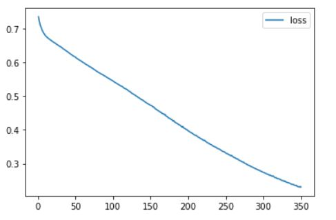

<!-- Find and Replace All [repo_name] -->
<!-- Replace [product-screenshot] [product-url] -->
<!-- Other Badgets https://naereen.github.io/badges/ -->
[![Contributors][contributors-shield]][contributors-url]
[![Forks][forks-shield]][forks-url]
[![Stargazers][stars-shield]][stars-url]
[![Issues][issues-shield]][issues-url]


# Machine learning index prediction
This repository represents comparing of performance machine learning model and neural network model. It uses yesterday’s market data from various SP500 sub-indexes.

---

## Approach

1. Data Formating

2. Creating and tuning the Neural network (Sequential)

3. Creating and tuning the Linear Regression and/or logistic

4. Comparison

---

## Technologies

This project leverages the following tools for financial analysis:

- [Conda](https://docs.conda.io/en/latest/) - source package management system and environment management system.

- [Pandas](https://pandas.pydata.org) - Python library that’s designed specifically for data analysis.

- [JupyterLab](https://jupyter.org) - For running and review Python-based programs.

- [StandardScaler](https://scikit-learn.org/stable/modules/generated/sklearn.preprocessing.StandardScaler.html) - For Standardization of datasets

- [scilit-learn](https://scikit-learn.org/stable/) - tool for predictive data alalysis

- [TensorFlow](https://www.tensorflow.org) - open-source machine learning platform

- [Keras](https://keras.io) - is an open-source software library that provides a Python interface for artificial neural networks.

---

## Input data

Input data is yesterday’s market data from various SP500 sub-indexes. Sub-indexes to use: Sectors.
`SP500.db` contains data for analysis.

Data is provided preformatted via the SP500.db. Tables included are:

- SectorDF: Base Data, includes all the SP500 stocks broken into sectors and averaged. Timeframe is 1Y.
- SectorDF3Y: 3 Year version of the Data.
- SectorDFNegative and SectorDF3YNegative: 1Y and 3Y versions of the data, but SPY is -1 when its negative instead of 0.
- SectorDFLarge and SectorDF3YLarge: 1Y and 3Y versions of the data, but spy is 1 if its greater than 0.005, -1 if less than -0.005, or 0 if in between.

Data can be pulled from teh Alpaca API using SP500.ipynb and stored in the DB. An alpaca API key is required and should be stored in a .env file (not included). However sample data is preloaded in the Database running the SPI is not necessary.

---

## Neural network

To create a neural network, a Sequential model was chosen. It is one of the most popular models in the Keras.

```
nn = Sequential() # creating model sequence
```

Example of the input data:


All data was separated for inputs and outputs:

1. Inputs are categories columns:

```
Industrials
Health Care
Information Technology
Communication Services
Consumer Staples
Consumer
Discretionary
Utilities
Financials
Materials
Real Estate
Energy
```

2. Outputs are SPY column transformed to discrete outputs/ like 0 and 1.

The test data (y_train) doesn't require to resampling. Proportions of the 0 and 1 are pretty similar.

```
0.0    96
1.0    94
Name: SPY, dtype: int64
```

During testing, a more efficient configuration was revealed:

```
Model: "sequential"
_________________________________________________________________
 Layer (type)                Output Shape              Param #
=================================================================
 dense (Dense)               (None, 16)                192

 dense_1 (Dense)             (None, 16)                272

 dense_2 (Dense)             (None, 1)                 17

=================================================================
Total params: 481
Trainable params: 481
Non-trainable params: 0
```

After the trainig with 350 epochs. Great result!

```
Loss: 0.22692200541496277, Accuracy: 0.9263157844543457
```




But with the test data results. Not bad.

```
Loss: 0.9621024131774902, Accuracy: 0.578125
```

Unfortunately, using of the different activation functions (`linear, tanh, softmax`) and changing number of the layers didn't improve results.

Compute Receiver operating characteristic (ROC)


The top left corner of the plot is the “ideal” point - a false positive rate of zero, and a true positive rate of one.
In our case, the curve is on the true positive side throughout its length, which is not ideal, but indicates the prevalence of a more correct prediction.

---

## Contributors
Mike Canavan

Glupak Vladislav [Linkedin](https://www.linkedin.com/in/vladislav-glupak/)

Jose Tollinchi [Linkedin](https://www.linkedin.com/in/josetollinchi/)

David Lee Ping [Linkedin](https://www.linkedin.com/in/david-lee-ping/)

<!-- Dev Patel [Linkedin](https://www.linkedin.com/in/josetollinchi/) -->

<!-- Ashok Kumar [Linkedin](https://www.linkedin.com/in/josetollinchi/) -->

---
Other Acknowledgements
* [Img Shields](https://shields.io)
* [Choose an Open Source License](https://choosealicense.com)

<!-- MARKDOWN LINKS & IMAGES -->
<!-- https://www.markdownguide.org/basic-syntax/#reference-style-links -->
[contributors-shield]: https://img.shields.io/github/contributors/AnaIitico/machine_learning_index_prediction.svg?style=for-the-badge
[contributors-url]: https://github.com/AnaIitico/machine_learning_index_prediction/graphs/contributors
[forks-shield]: https://img.shields.io/github/forks/AnaIitico/machine_learning_index_prediction.svg?style=for-the-badge
[forks-url]: https://github.com/AnaIitico/machine_learning_index_prediction/network/members
[stars-shield]: https://img.shields.io/github/stars/AnaIitico/machine_learning_index_prediction.svg?style=for-the-badge
[stars-url]: https://github.com/AnaIitico/machine_learning_index_prediction/stargazers
[issues-shield]: https://img.shields.io/github/issues/AnaIitico/machine_learning_index_prediction/network/members?style=for-the-badge
[issues-url]: https://github.com/AnaIitico/machine_learning_index_prediction/issues
[license-url]: https://choosealicense.com/licenses/mit/#

---
## License

[](https://opensource.org/licenses/MIT)
